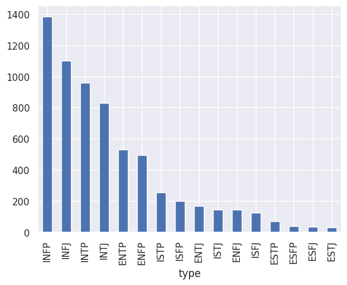

# **MBTI DATASET TEXT ANALYSIS | NATURAL LANGUAGE PROCESSING**  
*Exploring Personality Traits Through Text Data*  


## **INTRODUCTION**  
The **Myers-Briggs Type Indicator (MBTI)** is a widely used personality classification system. This project applies **Natural Language Processing (NLP)** techniques to analyze and process text data from users with different MBTI personality types.  

By leveraging **text preprocessing and feature extraction**, we aim to explore **language patterns** across different personality types.  

---

## **PROBLEM STATEMENT**  
Personality traits influence **how people express themselves through language**. Understanding these linguistic patterns can benefit:  
- **Social Media Analysis** – Identifying how different personality types communicate.  
- **Psychological Research** – Understanding relationships between personality and word usage.  
- **Text Processing Techniques** – Exploring NLP tools for feature extraction.  

This project focuses on:  
- **Processing text data** for personality analysis.  
- **Extracting features from text** using NLP techniques.  
- **Exploring personality distributions and common linguistic patterns.**  

---

## **SKILL DEMONSTRATION**  
- **Text Preprocessing & Cleaning**  
- **Feature Engineering (TF-IDF, Word Frequency Analysis)**  
- **Exploratory Data Analysis (EDA)**  
- **Data Visualization** (Word Cloud, Tokenization, N-Grams)  

---

## **DATA SOURCING**  
The dataset is sourced from [Kaggle - MBTI Personality Dataset](https://www.kaggle.com/datasnaek/mbti-type) and includes:  

### **1. Personality Classification** (Target Variable)  
- **16 MBTI Personality Types** (e.g., INTJ, ENFP, ISTP).  

### **2. Textual Data**  
- **User Posts & Comments** – Text samples from various online platforms.  

---

## **TEXT PREPROCESSING & FEATURE EXTRACTION**  
Text data was **cleaned and transformed** before analysis.  

### **1. Tokenization & Stopword Removal**  
- **Word Tokenization:**  
```python
from nltk.tokenize import word_tokenize

text = "MBTI personality types are fascinating!"
tokens = word_tokenize(text)
print(tokens)
```
- **Stopword Removal:**  
```python
from nltk.corpus import stopwords

stop_words = set(stopwords.words('english'))
filtered_tokens = [word for word in tokens if word.lower() not in stop_words]
print(filtered_tokens)
```
- **Key Insight:** Removing unnecessary words improves text analysis.  

### **2. Vectorization & Feature Extraction**  
- **TF-IDF Vectorization** for numerical text representation.  
- **N-Gram Analysis** for phrase detection.  

---

## **EXPLORATORY DATA ANALYSIS (EDA)**  
EDA was performed to **understand personality type distributions** and linguistic patterns.  

### **1. Personality Type Distribution**  
- **Bar Plot:**  
- **Key Finding:** Some personality types are more prevalent in the dataset.
  

### **2. Word Frequency Analysis**  
- **Word Cloud to visualize common words**:  
- **Key Finding:** Certain words are frequently associated with specific personality types.  

---

## **CONCLUSION**  
1. **Text processing techniques help uncover personality-driven language patterns.**  
2. **TF-IDF vectorization and N-Gram analysis provide deeper linguistic insights.**  
3. **Future work could apply machine learning models for personality classification.**  
